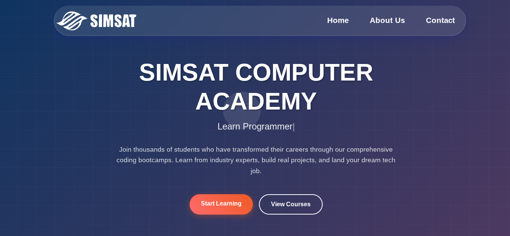

# SIMSAT Computer Academy

A modern, interactive website for SIMSAT Computer Academy featuring dynamic animations, course filtering, and an engaging user experience.

 
 
 🔗 Live Preview
<a href="https://waris24w.github.io/Simsat-Site/">View Live Demo</a>

## 🌟 Features

- **Responsive Design**: Fully responsive layout that works on all devices
- **Animated Hero Section**: Dynamic typewriter effect displaying different roles
- **Interactive Course Catalog**: Filter courses by difficulty level (Beginner, Intermediate, Advanced)
- **Smooth Animations**: GSAP-powered animations with scroll triggers
- **Team Showcase**: Horizontal scrolling team section with member profiles
- **Custom Cursor**: Interactive cursor effects in specific sections
- **Video Background**: Autoplay video section for enhanced visual appeal
- **Modern UI**: Contemporary design with gradients and smooth transitions

## 🚀 Technologies Used

- **HTML5**: Semantic markup structure
- **CSS3**: Modern styling with flexbox, grid, and custom properties
- **JavaScript (ES6+)**: Interactive functionality and DOM manipulation
- **GSAP (GreenSock)**: Advanced animations and scroll triggers
- **Typed.js**: Typewriter animation effects
- **Locomotive Scroll**: Smooth scrolling library

## 📁 Project Structure

```
simsat-academy/
│
├── index.html          # Main HTML file
├── styles.css          # CSS stylesheet
├── src.js              # JavaScript functionality
├── resuorses/          # Assets folder
│   ├── logo.svg        # Academy logo
│   └── video.mp4       # Background video
└── README.md           # This file
```

## 🛠️ Installation & Setup

1. **Clone the repository**
   ```bash
   git clone <repository-url>
   cd simsat-academy
   ```

2. **Ensure assets are in place**
   - Add your logo as `resuorses/logo.svg`
   - Add your background video as `resuorses/video.mp4`

3. **Open in browser**
   - Simply open `index.html` in your web browser
   - Or use a local server for better performance:
   ```bash
   # Using Python
   python -m http.server 8000
   
   # Using Node.js
   npx serve .
   ```

## 📱 Sections Overview

### Hero Section
- Animated title and description
- Typewriter effect cycling through different tech roles
- Call-to-action buttons
- Custom cursor effects
- Animated grid background

### Course Section
- Dynamic course filtering system
- 5 pre-loaded courses across different difficulty levels
- Interactive course cards with hover effects
- Filter buttons for easy navigation

### About Section
- Academy information and mission statement
- Image and text animations triggered on scroll
- Responsive layout with proper content hierarchy

### Team Section
- Horizontal scrolling showcase
- Individual team member profiles
- Skill tags and role descriptions
- Progress indicator dots
- Hover animations for member cards

### Footer
- Academy information and social links
- Newsletter subscription
- Course and company links
- Copyright information

## ⚙️ Key Functions

### `autoText()`
Initializes the typewriter animation for the hero section displaying different tech roles.

### `displayCategory(level)`
Filters and displays courses based on difficulty level:
- `"Beginner"` - Entry-level courses
- `"Intermediate"` - Mid-level courses  
- `"Advanced"` - Expert-level courses
- `"All"` - Shows all available courses

### `mainCurser()`
Controls custom cursor visibility across different sections of the site.

## 🎨 Customization

### Adding New Courses
Edit the `courses` array in `src.js`:

```javascript
const courses = [
    {
        title: "Your Course Title",
        level: "Beginner|Intermediate|Advanced",
        icon: "📱", // Emoji icon
        duration: "X Weeks",
        description: "Course description...",
        features: [
            "Feature 1",
            "Feature 2",
            "Feature 3",
            "Feature 4"
        ]
    }
];
```

### Modifying Team Members
Update the team member HTML in the `.team-members` section with new member information, images, and skills.

### Styling Changes
- Colors and themes can be modified in `styles.css`
- Animation timing and effects can be adjusted in `src.js`
- Typography and spacing can be customized via CSS variables

## 📦 Dependencies

All dependencies are loaded via CDN:

- **GSAP**: Animation library
  - Core: `https://cdnjs.cloudflare.com/ajax/libs/gsap/3.13.0/gsap.min.js`
  - ScrollTrigger: `https://cdnjs.cloudflare.com/ajax/libs/gsap/3.13.0/ScrollTrigger.min.js`
- **Typed.js**: Typewriter effects
  - `https://cdn.jsdelivr.net/npm/typed.js@2.0.12`
- **Locomotive Scroll**: Smooth scrolling
  - `https://cdn.jsdelivr.net/npm/locomotive-scroll@3.5.4/dist/locomotive-scroll.js`

## 🔧 Browser Support

- Chrome 60+
- Firefox 55+
- Safari 12+
- Edge 79+

## 📝 Notes

- The project uses modern JavaScript features (ES6+)
- All animations are optimized for performance
- Images are loaded from external URLs (consider hosting locally for production)
- Video autoplay requires user interaction on some browsers

## 🚀 Deployment

For production deployment:

1. **Optimize assets**
   - Compress images and videos
   - Minify CSS and JavaScript
   - Host assets locally instead of using external URLs

2. **Configure server**
   - Ensure proper MIME types for all files
   - Enable gzip compression
   - Set up proper caching headers

3. **SEO Optimization**
   - Add meta descriptions and keywords
   - Include Open Graph tags
   - Implement structured data markup

## 📄 License

This project is created for SIMSAT Computer Academy. All rights reserved.

## 🤝 Contributing

To contribute to this project:

1. Fork the repository
2. Create a feature branch
3. Make your changes
4. Test thoroughly
5. Submit a pull request

## 📞 Contact

For questions or support regarding this website, please contact SIMSAT Computer Academy through the website's contact form or social media channels.

---

**Built with ❤️ for SIMSAT Computer Academy**
